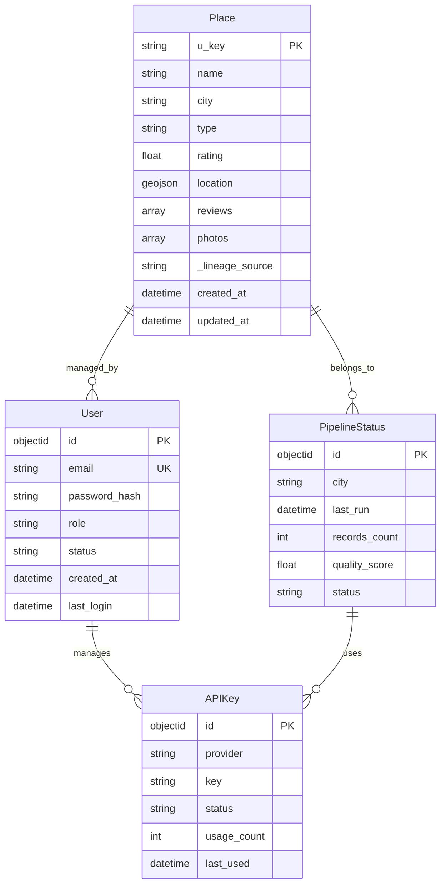
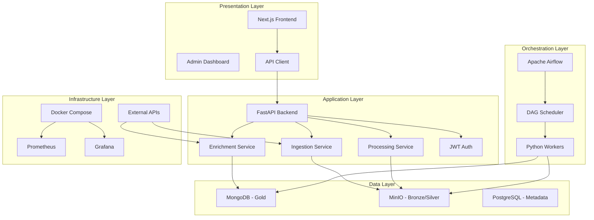
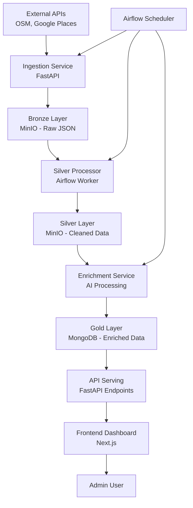

# Tài liệu Thiết kế Hệ thống Chi tiết (Detailed System Design)

## Dự án: Smart Travel Data Platform (Hệ thống Nền tảng Dữ liệu Du lịch Thông minh)

---

### 1. Tổng quan Kiến trúc Hệ thống

Hệ thống Smart Travel Data Platform được thiết kế theo kiến trúc **Modern Data Stack** với mô hình **Medallion Architecture** (Bronze → Silver → Gold), kết hợp với **Event-Driven Microservices** để đảm bảo khả năng mở rộng, độ tin cậy và hiệu suất cao.

#### 1.1. Nguyên tắc Thiết kế
- **Separation of Concerns:** Tách biệt rõ ràng giữa thu thập dữ liệu (Ingestion), xử lý (Processing), và phục vụ (Serving).
- **Scalability:** Sử dụng containerization (Docker) và orchestration (Airflow) để dễ dàng scale theo nhu cầu.
- **Data Quality:** Áp dụng các quy tắc nghiệp vụ (Business Rules) để đảm bảo dữ liệu sạch và đáng tin cậy.
- **Security:** Triển khai RBAC (Role-Based Access Control), JWT authentication, và encryption cho dữ liệu nhạy cảm.

#### 1.2. Công nghệ Chính
- **Frontend:** Next.js (React) với TypeScript.
- **Backend:** FastAPI (Python) với RESTful API.
- **Database:** MongoDB (NoSQL) cho dữ liệu Gold Layer, PostgreSQL cho metadata Airflow.
- **Storage:** MinIO (S3-compatible) cho Bronze/Silver Layers.
- **Orchestration:** Apache Airflow cho workflow tự động.
- **AI Integration:** Google Gemini API cho enrichment dữ liệu.
- **Monitoring:** Prometheus + Grafana cho observability.

---

### 2. Entity-Relationship Diagram (ERD)

ERD mô tả các thực thể chính và mối quan hệ trong hệ thống, tập trung vào dữ liệu cốt lõi về POI (Point of Interest) và quản trị hệ thống.

#### 2.1. Các Thực thể Chính

1. **Place (Địa điểm)**
   - `u_key` (String, Primary Key): Khóa định danh duy nhất.
   - `name` (String): Tên địa điểm.
   - `city` (String): Thành phố.
   - `type` (String): Loại địa điểm (restaurant, hotel, etc.).
   - `rating` (Float): Đánh giá trung bình.
   - `location` (GeoJSON): Tọa độ địa lý.
   - `reviews` (Array): Danh sách review.
   - `photos` (Array): Danh sách URL ảnh.
   - `_lineage_source` (String): Nguồn gốc dữ liệu (OSM, Google, etc.).
   - `created_at` (DateTime): Thời gian tạo.
   - `updated_at` (DateTime): Thời gian cập nhật.

2. **User (Người dùng Quản trị)**
   - `id` (ObjectId, Primary Key): ID duy nhất.
   - `email` (String, Unique): Email đăng nhập.
   - `password_hash` (String): Mật khẩu đã hash.
   - `role` (String): Vai trò (Admin, Operator).
   - `status` (String): Trạng thái (Active, Inactive).
   - `created_at` (DateTime): Thời gian tạo.
   - `last_login` (DateTime): Lần đăng nhập cuối.

3. **PipelineStatus (Trạng thái Pipeline)**
   - `id` (ObjectId, Primary Key): ID duy nhất.
   - `city` (String): Thành phố xử lý.
   - `last_run` (DateTime): Lần chạy cuối.
   - `records_count` (Integer): Số bản ghi xử lý.
   - `quality_score` (Float): Điểm chất lượng dữ liệu.
   - `status` (String): Trạng thái (Running, Completed, Failed).

4. **APIKey (Khóa API)**
   - `id` (ObjectId, Primary Key): ID duy nhất.
   - `provider` (String): Nhà cung cấp (Google, OSM).
   - `key` (String, Encrypted): Khóa API đã mã hóa.
   - `status` (String): Trạng thái (Active, Expired).
   - `usage_count` (Integer): Số lần sử dụng.
   - `last_used` (DateTime): Lần sử dụng cuối.

#### 2.2. Mối Quan hệ

- **Place ↔ User:** 1 User có thể quản lý nhiều Place (1:N), thông qua trường `managed_by` trong Place.
- **Place ↔ PipelineStatus:** 1 PipelineStatus liên kết với nhiều Place trong cùng city (1:N).
- **User ↔ APIKey:** 1 User có thể quản lý nhiều APIKey (1:N).
- **PipelineStatus ↔ APIKey:** 1 PipelineStatus sử dụng nhiều APIKey (N:M), thông qua bảng trung gian `PipelineKeyUsage`.

#### 2.3. Sơ đồ ERD (Mermaid)

---

### 3. System Architecture Diagram

Kiến trúc hệ thống được chia thành các layer chính: Presentation, Application, Data, và Infrastructure.

#### 3.1. Các Component Chính

1. **Frontend Layer (Presentation)**
   - Next.js Application: Giao diện quản trị cho Admin.
   - Components: Dashboard, Pipeline Monitor, Data Explorer.
   - API Client: Axios với timeout handling.

2. **Backend Layer (Application)**
   - FastAPI Server: RESTful API cho business logic.
   - Services: IngestionService, ProcessingService, EnrichmentService.
   - Authentication: JWT + RBAC.

3. **Data Layer**
   - Bronze Layer: MinIO S3 - Dữ liệu thô JSON.
   - Silver Layer: MinIO S3 - Dữ liệu đã xử lý cơ bản.
   - Gold Layer: MongoDB - Dữ liệu sạch, indexed cho query nhanh.
   - Metadata DB: PostgreSQL cho Airflow.

4. **Orchestration Layer**
   - Apache Airflow: Scheduler cho DAGs (Directed Acyclic Graphs).
   - Workers: Python processes cho data processing.

5. **Infrastructure Layer**
   - Docker Compose: Container orchestration.
   - Monitoring: Prometheus, Grafana, AlertManager.
   - External APIs: Google Places API, OSM API.

#### 3.2. Sơ đồ Kiến trúc Hệ thống (Mermaid)

#### 3.3. Data Flow Architecture

---

### 4. Chi tiết Các Component

#### 4.1. Frontend (Next.js)
- **Technology:** React 18, TypeScript, Tailwind CSS.
- **Features:** 
  - Dashboard với charts (Recharts).
  - Pipeline monitoring real-time.
  - Data explorer với filters.
- **API Integration:** Axios client với 120s timeout cho large datasets.

#### 4.2. Backend (FastAPI)
- **Technology:** Python 3.11, FastAPI, Pydantic.
- **Endpoints:**
  - `/api/pipeline/run`: Trigger ingestion.
  - `/api/data/places`: Query Gold data.
  - `/api/admin/keys`: Manage API keys.
- **Services:**
  - IngestionService: Fetch from APIs.
  - ProcessingService: Deduplication, normalization.
  - EnrichmentService: AI-powered data enhancement.

#### 4.3. Database (MongoDB)
- **Collections:**
  - `places`: Gold layer data.
  - `users`: Admin users.
  - `pipeline_status`: Processing metadata.
- **Indexes:** Compound indexes trên `city`, `type`, `rating`.

#### 4.4. Storage (MinIO)
- **Buckets:**
  - `bronze`: Raw data files.
  - `silver`: Processed data files.
- **Features:** S3-compatible API, versioning.

#### 4.5. Orchestration (Airflow)
- **DAGs:**
  - `ingestion_dag`: Daily data collection.
  - `processing_dag`: Data cleaning pipeline.
  - `enrichment_dag`: AI enhancement.
- **Operators:** PythonOperator, BashOperator.

#### 4.6. Monitoring
- **Prometheus:** Metrics collection.
- **Grafana:** Dashboards cho KPIs.
- **AlertManager:** Notifications via Telegram/Email.

---

### 5. Quy tắc và Constraints

#### 5.1. Data Quality Rules
- Deduplication: Sử dụng `u_key` dựa trên normalized name + rounded coordinates.
- Quality Score: > 0.7 để promote lên Gold layer.
- Lineage Tracking: Mọi bản ghi phải có `_lineage_source`.

#### 5.2. Security Constraints
- API Keys: Encrypted storage, rotation every 30 days.
- User Access: RBAC với roles Admin/Operator.
- Data Encryption: TLS 1.3 cho all communications.

#### 5.3. Performance Constraints
- Query Latency: < 2s cho Gold layer queries.
- Ingestion Time: < 1 hour cho 10,000 POIs.
- Storage Growth: < 20% monthly increase.

---

### 6. Deployment và Scaling

#### 6.1. Development Environment
- Docker Compose: Single-node setup.
- Volumes: Persistent storage cho data.

#### 6.2. Production Environment
- Kubernetes: Multi-node scaling.
- Load Balancer: NGINX ingress.
- Backup: Automated MongoDB dumps.

#### 6.3. Scaling Strategy
- Horizontal: Add more Airflow workers.
- Vertical: Increase MongoDB cluster size.
- Caching: Redis cho frequent queries.

---

*Tài liệu này là tài sản kỹ thuật của Smart Travel Data Platform, dùng để hướng dẫn triển khai và bảo trì hệ thống.*
